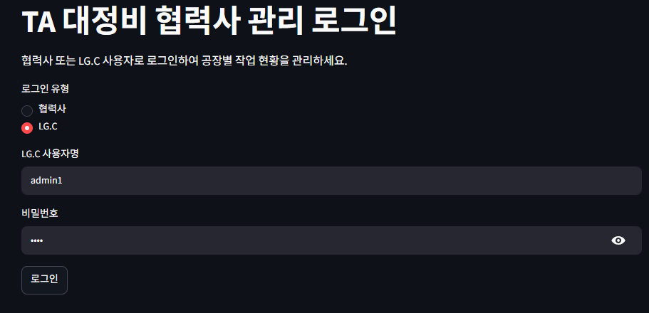
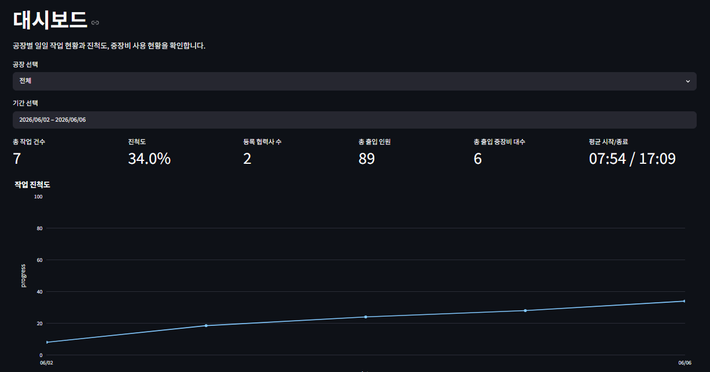
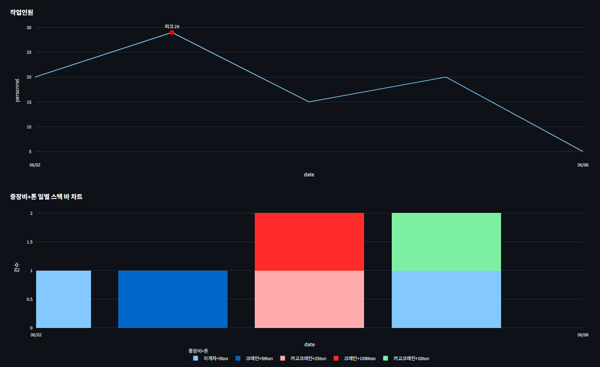
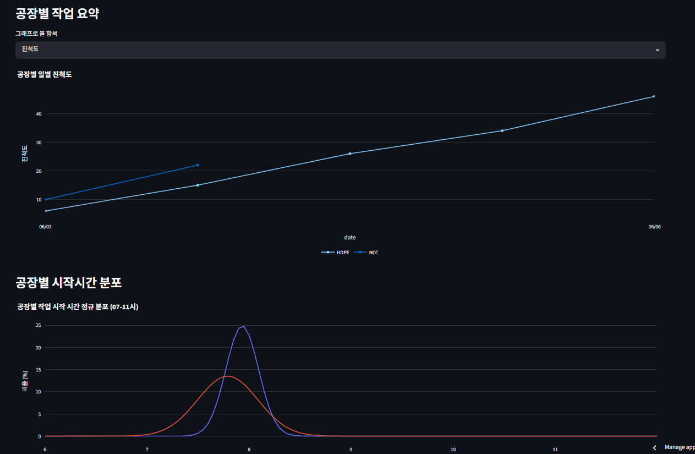
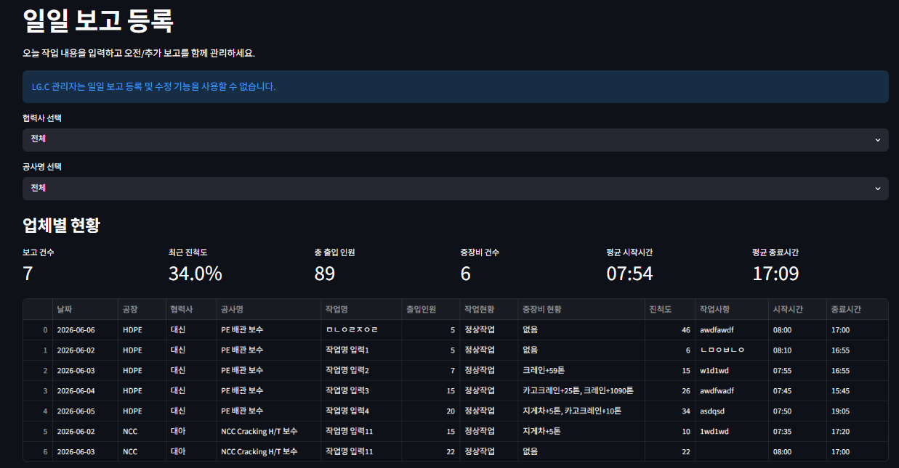

last wakeup: 2026-06-17 11:00

# 🎈 LGC TA 협력사 관리 시스템
> **배포 주소**: https://lgc-ta-contractor-management-system-oqh6fn5lr98n5rah37hnkz.streamlit.app

LG화학 TA(Turn Around) 기간 중 협력사의 작업 현황, 투입 인원, 중장비 사용 현황을 실시간으로 취합하고 데이터 기반으로 모니터링하기 위한 웹 기반 비즈니스 대시보드 시스템입니다.

## 👨‍💻 개발 목적
본 시스템은 LG화학 TA 기간 동안 발생하는 대규모 협력사 작업 데이터를 체계적으로 관리합니다. 기존에 수기로 작성하고 개별 취합하던 작업 현황 관리 방식을 모바일 기반 앱 환경으로 전환하여, 현장 관리자의 업무 효율을 향상하고 실시간으로 투입 현황을 정밀 모니터링하는 것을 목적으로 개발되었습니다.

---

## 🛠️ 기술 스택 (Technical Stack)


| 구분 | 적용 기술 및 라이브러리 | 상세 용도 |
| :--- | :--- | :--- |
| **Frontend & Server** | `Streamlit` | 웹 인터페이스 구성 및 앱 인프라 구동 |
| **Language** | `Python (v3.11)` | 백엔드 비즈니스 로직 및 파일 입출력 처리 |
| **Data Processing** | `Pandas`, `NumPy` | 시계열 데이터 가공, 다차원 집계 및 정규분포 연산 |
| **Visualization** | `Plotly (Express / Graph Objects)` | 모바일 최적화 실시간 라인/스택바 그래프 구현 |
| **Image Processing** | `Pillow (PIL)` | 현장 사진 용량 압축 및 가중치 기반 리사이즈 |
| **Storage** | `CSV (File System 기반)` | 공지사항/일일 보고/평가 마일리지 영구 저장 데이터 |
| **Deployment** | `Streamlit Community Cloud` | 클라우드 인프라 실시간 웹 배포 및 운영 |

---

## 📌 주요 기능

### 🔐 로그인 및 권한 관리
* **관리자 권한 (LG.C / 최고 관리자)**: 시스템 마스터 패스워드 검증을 통해 진입하며 협력사 평가, 마일리지 부여, 공지사항 등록 및 삭제 등 전역 제어 기능 제공
* **협력사 권한**: 지정된 계정으로 로그인 시 해당 업체가 등록한 일일 보고 데이터만 조회 및 추가/마감 수정 가능 (타사 데이터 접근 차단 및 보안 유지)

### 📊 대시보드 및 실시간 시각화




* **핵심 지표 (Metric)**: 총 작업 건수, 전 공장 누적 진척도, 등록 협력사 수, 총 출입 인원, 총 출입 중장비 대수, 평균 작업 시작/종료 시간 실시간 노출
* **정밀 진척도 연산**: 특정 작업의 공정이 잠시 멈추더라도 과거의 마지막 진척도 수치를 보존하여 전체 통계에 누적 합산하는 타임라인 알고리즘 반영
* **모바일 스크롤 스케일 잠금**: 스마트폰 세로 화면에서 그래프 터치 시 화면이 굳거나 줌인/확대되는 현상을 전면 차단하고 부드러운 웹 브라우저 스크롤 환경 최적화

### 📋 작업 및 공지 관리
* **일 일 작업 보고**: 작업 일자, 공장, 협력사, 공사명, 출입인원, 중장비 톤수 기록 및 당일 마감 진척도 슬라이더 제어
* **서버 용량 최적화**: 첨부 사진 등록 시 자동 압축(Resize) 로직이 작동하며, 데이터 수정 및 삭제 시 서버 디스크에 남은 구형 물리 파일(`Path.unlink`)과 빈 디렉토리까지 동기화하여 완벽 영구 제거
* **전체 공지사항**: 전 공장 및 협력사에 실시간 공지 하향 전파 및 이미지 타임라인 레이아웃 제공

---

## 📂 프로젝트 구조 (Project Structure)


| 파일/디렉토리 경로 | 파일 파일 형태 | 상세 역할 정의 |
| :--- | :--- | :--- |
| 📄 `streamlit_app.py` | 파이썬 소스 코드 | 시스템 메인 프로그램 및 탭별 라우팅 허브 제어 파일 |
| 📄 `requirements.txt` | 패키지 명세서 | 앱 실행에 필수적인 외부 라이브러리 및 의존성 버전 목록 |
| 📄 `README.md` | 마크다운 문서 | 본 프로젝트 관리 매뉴얼 및 가이드 문서 (현재 파일) |
| 📁 `data/` | 디렉토리 | 저장 공간 데이터가 보관되는 물리 저장 공간 홈 루트 |
| 📄 `data/daily_reports.csv` | 데이터 파일 | 협력사별 작업 현황, 출입 인원, 시작/종료 시간, 진척도 보관 DB |
| 📄 `data/announcements.csv` | 데이터 파일 | 전사 공지사항 제목, 작성일, 내용 및 파일 연결 링크 인덱스 |
| 📄 `data/evaluations.csv` | 데이터 파일 | 협력사 칭찬, 경고 누계 및 마일리지 합산용 기초 세부 데이터 |
| 📁 `data/daily_images/` | 이미지 디렉토리 | 날짜별 / 협력사별로 자동 분류되어 저장되는 일일 보고 사진 저장소 |
| 📁 `data/announcement_images/` | 이미지 디렉토리 | 등록된 공지사항에 첨부된 원본 최적화 이미지 파일 보관 디렉토리 |
| 📁 `data/evaluation_images/` | 이미지 디렉토리 | 협력사 평가 및 경고 현장 증빙용 사진 데이터 저장 폴더 |

---

## 🚀 설치 및 로컬 실행 방법

1. **저장소 복제**
```bash
git clone https://github.com
cd LGC-TA-Contractor-Management-System
```

2. **패키지 의존성 설치**
```bash
pip install -r requirements.txt
```

3. **애플리케이션 구동**
```bash
streamlit run streamlit_app.py
```

---

## 🎯 기대 효과
* **실시간 가시성 확보**: TA 기간 중 흩어져 있는 협력사들의 진척 상태를 한눈에 파악하여 병목 구간 조기 발견 지원
* **데이터 기반 의사결정**: 중장비 사용 현황 및 공장별 투입 인원 피크 타임을 차트로 분석하여 효율적인 인프라 배치 유도
* **업무 리소스 절감**: 불필요한 수기 서류 작성과 전화 취합 절차를 생략하여 현장 안전 관리자 및 팀장들의 업무 생산성 고도화

---
*본 저장소는 GitHub Pro 기능을 활용하여 원스톱으로 코드를 관리하고 있습니다.*
